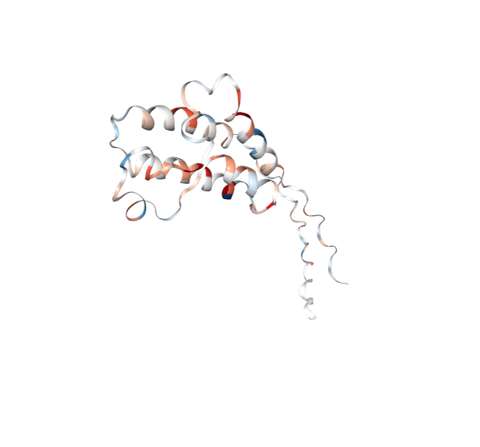

<!-- README.md is generated from README.Rmd. Please edit that file -->

```{r, include = FALSE}
knitr::opts_chunk$set(
    collapse = TRUE,
    comment = "#>",
    fig.path = "man/figures/README-",
    out.width = "100%"
)
```

# ReX

<!-- badges: start -->
[](https://lifecycle.r-lib.org/articles/stages.html#experimental)
[](https://bioconductor.org/checkResults/release/bioc-LATEST/ReX)
[](https://bioconductor.org/checkResults/devel/bioc-LATEST/ReX)
[](http://bioconductor.org/packages/stats/bioc/ReX/)
[](https://support.bioconductor.org/tag/ReX)
[](https://bioconductor.org/packages/release/bioc/html/ReX.html#since)
[](http://bioconductor.org/checkResults/devel/bioc-LATEST/ReX/)
[](https://bioconductor.org/packages/release/bioc/html/ReX.html#since)
[](https://github.com/ococrook/ReX/actions/workflows/R-CMD-check-bioc.yaml)
[](https://app.codecov.io/gh/ococrook/ReX?branch=devel)
<!-- badges: end -->

The goal of `ReX` is to analyse hydrogen deuterium exchange mass spectrometry
(HDX-MS) data at the residue level. The package is designed to be used with
data from various platforms that have already been process at Spectrum-level.
`ReX` takes the processed peptide-level data and infers the residue level
deuterium uptake. The underlying model is a Bayesian non-parametric model that
recasts HDX-MS data analysis as a (latent) change-point detection problem.
The unique benefits of this model are the following: 
(1) It can provide statistical confidence at the level of residues (e.g.
a probability of change)
(2) Borrow statistical power from overlapping peptides
(3) Infer uptakes patterns that are hidden at the peptide-level because of
averaging
(4) Provide global and pre-residue resolution metrics
(5) It can perform single protein analysis, differential analysis and
confrontational signature analysis (many states/compounds)
(6) You can build predictive models with the inferred uptakes using partial 
least squares discriminant analysis (PLS-DA).
(7) You can costumize the model to your specific needs.

## Installation instructions

Get the latest stable `R` release from [CRAN](http://cran.r-project.org/). Then install `ReX` from [Bioconductor](http://bioconductor.org/) using the following code: 

Note that you cannot currently install from Bioconductor

```{r 'install', eval = FALSE}
if (!requireNamespace("BiocManager", quietly = TRUE)) {
    install.packages("BiocManager")
}

BiocManager::install("ReX")
```

To install the development version of `ReX`, it's easiest to use the
`remotes` package.


```{r 'install_dev', eval = FALSE}
if (!requireNamespace("remotes", quietly = TRUE)) {
    install.packages("remotes")
}

remotes::install_github("ococrook/ReX")
```

## Example

ReX has structure visualisation at part of its core functionality.
Below is an example of how to use the `hdx_to_pdb_colours` function to map HDX-MS data onto a PDB file. 

```{r example, eval = requireNamespace('ReX'), eval = FALSE}
library("ReX")
library(NGLVieweR)

# generate random HDX data
v <- matrix(rnorm(n = 477), nrow = 1)
colnames(v) <- seq.int(ncol(v)) # residue numbering

v2 <- v[, seq.int(344, 477), drop = FALSE]
colnames(v2) <- seq.int(ncol(v2))

pdb_filepath <- system.file("extdata", "test_BRD4.pdb", mustWork = TRUE, package = "ReX")

# generate a protection-deprotection colour mapping
mycolor_parameters <- hdx_to_pdb_colours(v2, pdb = pdb_filepath, cmap_name = "ProtDeprot")

# Note this will open in a view
view_structure(pdb_filepath = pdb_filepath, color_parameters = mycolor_parameters)
```

The expected output is a 3D structure of the protein with the HDX-MS data mapped
onto it. The colouring is based on the protection-deprotection scale.The
following image is indicative and may not be the same as the output you will see.


## Citation

Below is the citation output from using `citation('ReX')` in R. Please
run this yourself to check for any updates on how to cite __ReX__.

```{r 'citation', eval = requireNamespace('ReX')}
print(citation("ReX"), bibtex = TRUE)
```

Please note that the `ReX` was only made possible thanks to many other
R and bioinformatics software authors, which are cited either
in the vignettes and/or the paper(s) describing this package.

## Code of Conduct

Please note that the `ReX` project is released with a
[Contributor Code of Conduct](http://bioconductor.org/about/code-of-conduct/). 
By contributing to this project, you agree to abide by its terms.

## Development tools

* Continuous code testing is possible thanks to
[GitHub actions](https://www.tidyverse.org/blog/2020/04/usethis-1-6-0/) 
through `r BiocStyle::CRANpkg('usethis')`, `r BiocStyle::CRANpkg('remotes')`, 
and `r BiocStyle::CRANpkg('rcmdcheck')` customized to 
use [Bioconductor's docker containers](https://www.bioconductor.org/help/docker/) 
and `r BiocStyle::Biocpkg('BiocCheck')`.
* Code coverage assessment is possible thanks
to [codecov](https://codecov.io/gh) and `r BiocStyle::CRANpkg('covr')`.
* The code is styled automatically thanks to `r BiocStyle::CRANpkg('styler')`.
* The documentation is formatted thanks to `r BiocStyle::CRANpkg('devtools')` 
and `r BiocStyle::CRANpkg('roxygen2')`.

For more details, check the `dev` directory.

This package was developed using `r BiocStyle::Biocpkg('biocthis')`.


